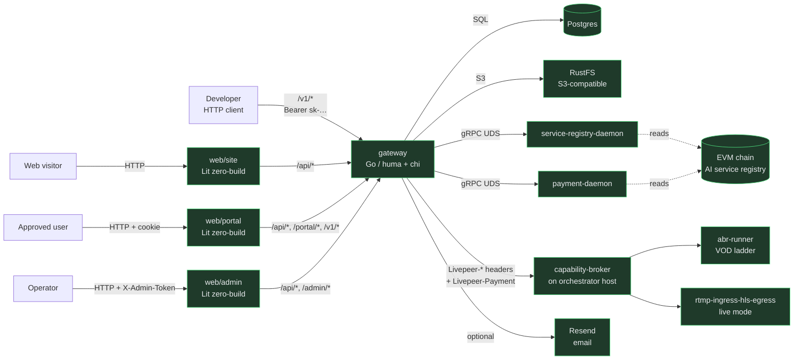
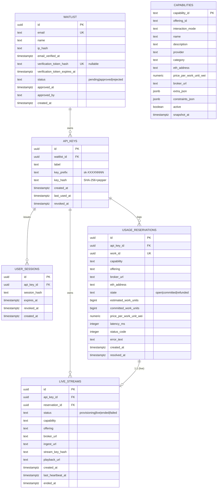
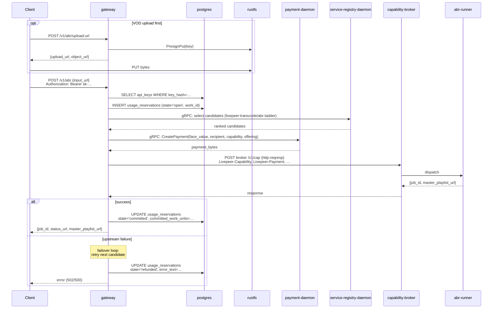
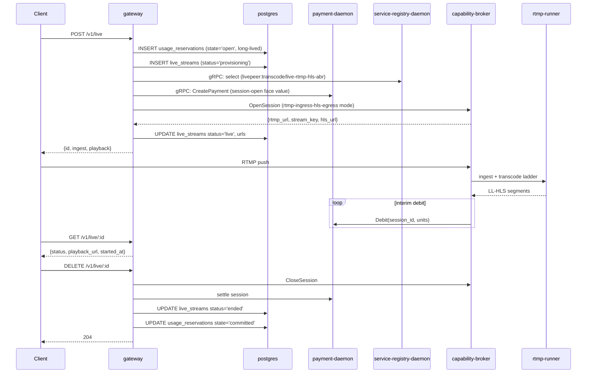
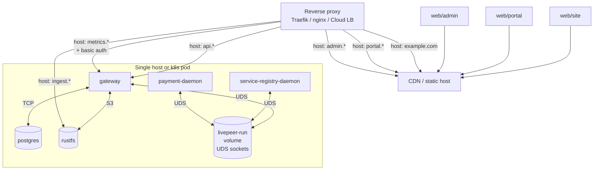

# ARCHITECTURE

Top-level map of the repository. Follows the
[ARCHITECTURE.md convention](https://matklad.github.io/2021/02/06/ARCHITECTURE.md.html):
this file is for *bird's-eye orientation*. Deeper detail lives in
[`docs/design-docs/`](./docs/design-docs/) and in each file's docstring.

For "what does this thing do?" see [`DESIGN.md`](./DESIGN.md).
For invariants, see
[`docs/design-docs/core-beliefs.md`](./docs/design-docs/core-beliefs.md).

---

## 1. System overview



Green = in this repo or a local compose service. Dashed gray = external
runtime peers (run as their own containers / on other hosts).

---

## 2. Components

| Component | Path | Purpose | Owns |
|---|---|---|---|
| **Gateway** | `gateway/` | Translates transcode requests → Livepeer wire. Hosts the SaaS shell (waitlist, sessions, API keys, admin). Presigns RustFS PUTs for VOD ingest. | The only stateful Go service in this repo. |
| **Marketing site** | `web/site/` | Public landing + waitlist signup + email-verification page. | Generic copy; rebrand at deploy time. |
| **Portal** | `web/portal/` | Authenticated user dashboard: account, API keys, usage, playground (Live + Transcode tabs). | Cookie-session UX. |
| **Admin** | `web/admin/` | Operator console: waitlist queue, users, usage, capability registry debug. | `X-Admin-Token` UX (stored in localStorage). |
| **Protos** | `proto/` | Vendored gRPC definitions for `payment-daemon` + `service-registry-daemon`. | Codegen target: `gateway/gen/proto/`. |

External services pulled at runtime:

| Service | Image | Local profile |
|---|---|---|
| `service-registry-daemon` | `tztcloud/livepeer-service-registry-daemon:v1.3.0` | `livepeer` |
| `payment-daemon` | `tztcloud/livepeer-payment-daemon:v1.3.0` | `livepeer` |
| `rustfs` | `rustfs/rustfs:latest` | default |
| `rustfs-bootstrap` (one-shot) | `minio/mc:latest` | default |
| `capability-broker` + runners | (operator side) | not in compose |

---

## 3. Gateway internal layering

```
            ┌────────────────────────────────────────────┐
            │ cmd/gateway/main.go  (process wiring)      │
            ├────────────────────────────────────────────┤
            │ internal/handlers/{waitlist,portal,admin,  │  ← HTTP surface
            │   v1}/  proxy/                             │
            ├────────────────────────────────────────────┤
            │ internal/proxy/service/  proxy/livepeer/   │  ← service / wire
            │ internal/email/  internal/s3/              │
            ├────────────────────────────────────────────┤
            │ internal/repo/  internal/registry/         │  ← data / RPC
            │ internal/schema/                           │
            ├────────────────────────────────────────────┤
            │ internal/config/  internal/db/             │  ← primitives
            │ internal/crypto/  internal/metrics/        │
            ├────────────────────────────────────────────┤
            │ gen/proto/  gen/db/                        │  ← generated
            └────────────────────────────────────────────┘
```

Edges go *down* only. Cross-cutting deps (config, DB pool, S3 client,
email, route selector, rate limiter, payment client) are bundled into
a `ServerDeps` struct in `main.go` and threaded into every handler.

### Source-of-truth split

| Subtree | Origin | Notes |
|---|---|---|
| `internal/proxy/livepeer/` | Ported from `livepeer-modules-openai/gateway/src/proxy/livepeer/` (TS→Go) | Load-bearing wire mechanics — payment minting, headers, http-reqresp dispatch, rtmp session lifecycle. |
| `internal/proxy/service/` | Same | Route selection, route health, dispatch loop. |
| `internal/proxy/{abr,live,capabilities}.go` | Built here | Transcode-specific handlers. |
| Everything else (`internal/handlers/`, `internal/repo/`, `internal/schema/`, `internal/crypto/`, `internal/email/`, `internal/metrics/`, `internal/db/`, `internal/config/`, `cmd/gateway/`) | Built here | Native Go, written for this repository. |

---

## 4. Data storage



**One Postgres database. One migration track.** `gateway/migrations/`
holds numbered `.sql` files applied by `golang-migrate` at boot.

### Why a `live_streams` table

VOD ABR maps cleanly to a per-request `usage_reservations` row. Live
RTMP sessions are long-lived (minutes-to-hours), need their own
client-facing ID, ingest URL, stream key, playback URL, and lifecycle
status. Splitting that into `live_streams` keeps `usage_reservations`
as the per-attempt billing log and gives live streams their own
identity surface.

### Why a `capabilities` cache table

`/v1/capabilities` must be cheap. Querying the gRPC resolver on every
call would couple catalog reads to chain availability. The background
refresh task (every `REGISTRY_REFRESH_INTERVAL_MS`, default 60s) writes
the latest snapshot into `capabilities`; HTTP reads from there.

---

## 5. Process flows

### 5.1 Signup → verify → approve → key

Identical to `livepeer-modules-openai`. See its
[ARCHITECTURE.md §5.1](../livepeer-modules-openai/ARCHITECTURE.md#51-signup--verify--approve--key)
for the sequence diagram — this repo's flow is byte-for-byte the same.

### 5.2 `/v1/abr` request lifecycle



### 5.3 `/v1/live` session lifecycle



### 5.4 Registry refresh

Identical to openai gateway, retargeted at the transcode capability set.
Writes to `capabilities` table instead of `models`.

### 5.5 Portal cookie auth

Identical to openai gateway.

---

## 6. External dependencies

| What | How it talks to us |
|---|---|
| HTTP clients | HTTPS → `/v1/*` (Bearer auth) |
| Portal / admin / site users | HTTPS → static SPAs + JSON APIs |
| `service-registry-daemon` | gRPC over UDS (`/var/run/livepeer/service-registry.sock`) |
| `payment-daemon` | gRPC over UDS (`/var/run/livepeer/payer-daemon.sock`) |
| `capability-broker` (on orch host) | HTTPS, per Livepeer wire spec |
| RustFS | S3 API over HTTP (compose network) |
| Postgres | TCP, single DB for all SaaS + live-stream data |
| Resend | HTTPS, email delivery (optional in dev) |
| EVM chain (Arbitrum One by default) | Indirectly — only via the two daemons |

---

## 7. Boundaries that matter

- **The proxy doesn't know about humans.** `/v1/*` authenticates via
  API key and joins to `usage_reservations.api_key_id`. Names + emails
  live in `waitlist`. The only join between the two namespaces is
  `api_keys.waitlist_id`.
- **The wire spec is product-agnostic.** `proxy/livepeer/` only knows
  `Livepeer-Capability` headers + interaction modes. Mapping
  transcode-product → capability happens in
  `proxy/{abr,live,capabilities}.go`.
- **The SaaS shell is product-agnostic.** The same shell powers
  `livepeer-modules-openai`. Transcode specifics live in
  `internal/proxy/{abr,live,capabilities}.go` and the `live_streams`
  table.
- **Media bytes never traverse Go.** VOD bytes go client → RustFS →
  runner. Live bytes go client → broker → runner. The gateway only
  signs URLs and reads catalog state.
- **Runners don't import from the gateway and vice versa.** The only
  contract is the Livepeer wire spec, mediated by the broker.

---

## 8. Observability

- **Prometheus** `/metrics` on the gateway, optionally Bearer-gated
  via `METRICS_TOKEN`. Surfaces:
  - Default Go runtime metrics under prefix `video_gateway_*`
  - HTTP: `video_gateway_http_requests_total{method,route,status}`,
    `video_gateway_http_request_duration_seconds`
  - Proxy: `video_gateway_proxy_reservations_total{capability,outcome}`,
    `video_gateway_live_streams_active`
  - Waitlist: `video_gateway_waitlist_signups_total`
  - Route health: `livepeer_gateway_route_health_*`
- **Structured JSON logs** to stdout via `log/slog`. Request IDs
  propagated as `Livepeer-Request-Id` on `/v1/*`.
- **`usage_reservations`** + **`live_streams`** are the durable
  per-request and per-session logs (queryable via `/admin/usage` and
  `/portal/usage`).

---

## 9. Deployment shape



In dev, the same shape collapses: `make dev` runs gateway + db + rustfs
+ bootstrap; each SPA runs via its own `dev-server.js`.

---

## 10. Out of scope here

- The Livepeer wire spec itself — owned by `livepeer-network-protocol`
  in the source monorepo.
- The on-chain service registry contracts — operated separately.
- The `capability-broker` + `abr-runner` + `rtmp-ingress-hls-egress`
  binaries — owned by `livepeer-network-modules`.
- Gateway-side playback proxy — v2 concern; v1 returns broker HLS URLs.
- Multi-region deployment topology.
