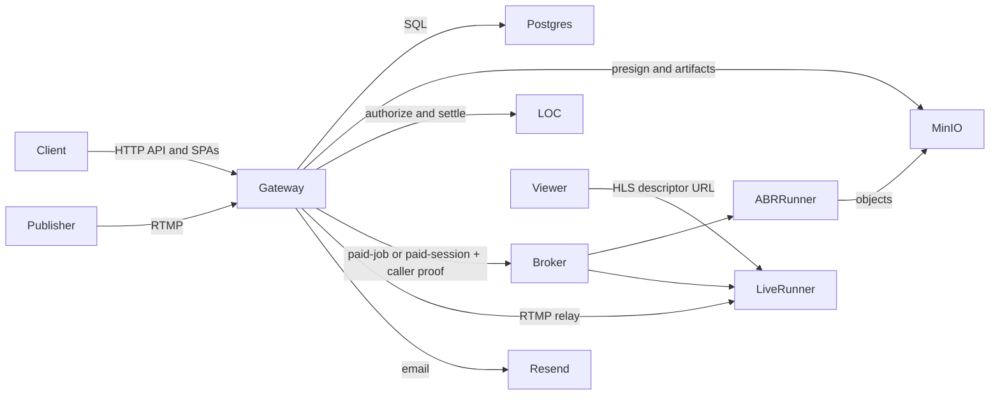

# ARCHITECTURE

This file maps current components. The [design](DESIGN.md) explains the
boundaries and [Modules v2](docs/design-docs/modules-v2.md) records compatibility
sources and migration rationale.

```mermaid
flowchart LR
  Client -->|HTTP API and SPAs| Gateway
  Publisher -->|RTMP| Gateway
  Gateway -->|SQL| Postgres
  Gateway -->|presign and artifacts| MinIO
  Gateway -->|authorize and settle| LOC
  Gateway -->|paid-job or paid-session + caller proof| Broker
  Broker --> ABRRunner
  Broker --> LiveRunner
  Gateway -->|RTMP relay| LiveRunner
  ABRRunner -->|objects| MinIO
  Viewer -->|HLS descriptor URL| LiveRunner
  Gateway -->|email| Resend
```

`gateway/cmd/gateway` wires the process. `internal/server` owns HTTP handlers
and durable operation orchestration. `internal/proxy/loc` implements LOC
requests; `internal/proxy/livepeer` implements delegated caller signing and
broker protocols. `internal/repo` persists state, `internal/registry` refreshes
the catalog, `internal/crypto` protects credentials, `internal/s3` handles
object storage, and `internal/rtmp` implements public ingest and relay.

The zero-build Lit applications under `web/site`, `web/portal` and `web/admin`
are copied into `gateway/internal/server/webroot` before compilation and
embedded into the Go binary. They share the production HTTP port; `make web`
provides optional development servers.

Postgres holds accounts, hashed keys, cookie sessions, usage reservations,
live streams, capabilities, and paid operations. Paid operations hold stable
workload/idempotency identity, protocol progress, encrypted recovery secrets,
and final evidence. Usage rows remain the customer/admin reporting view;
LOC remains authoritative for funding and billed amounts. Migrations under
`gateway/migrations` are applied at boot.

An ABR submission creates durable state before authorizing a workload through
LOC. The broker dispatches `video-transcode-abr/v2` and streams progress plus
terminal completion over SSE. The gateway records that outcome and settles
signed evidence; customers poll its API for results. Recovery reuses identity
rather than blindly creating another billable operation.

Live creation prepares and authorizes a `paid-session/v1` workload, then
opens the broker session and consumes its `rtmp-hls/v1` descriptor. The
gateway uses the stream-key grant for its upstream relay while exposing its
own customer stream key. Refill increases the cumulative authorized cap;
settlement uses finalized whole output seconds. Shutdown closes ingress and
reconciles broker evidence with LOC.

The catalog refresher atomically stores LOC offerings with protocol, work
unit, price denominator, estimator and job/session axes. The API reads this
snapshot; the catalog does not advertise a selected broker identity.

The default Compose deployment contains gateway, Postgres, MinIO and its
bootstrap service. LOC, brokers and runners are external. Deploy a single
gateway instance until distributed operation/session ownership is validated.
See [DEPLOYMENT.md](DEPLOYMENT.md) for secrets, upgrades and network reachability.
