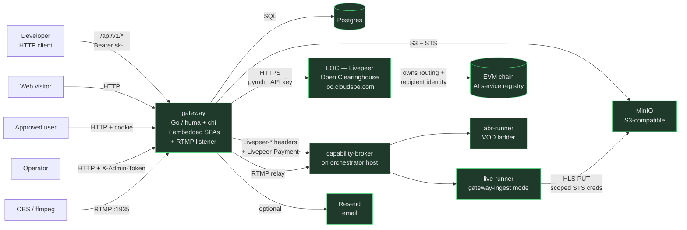
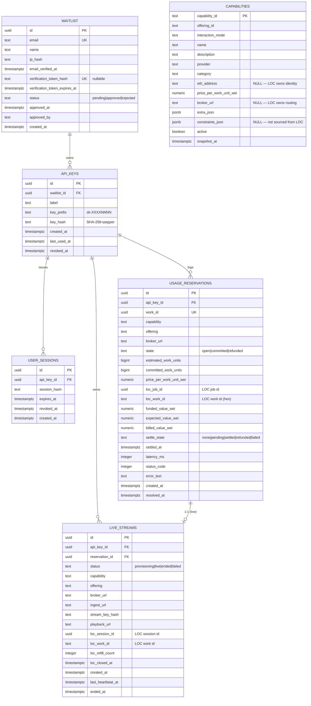
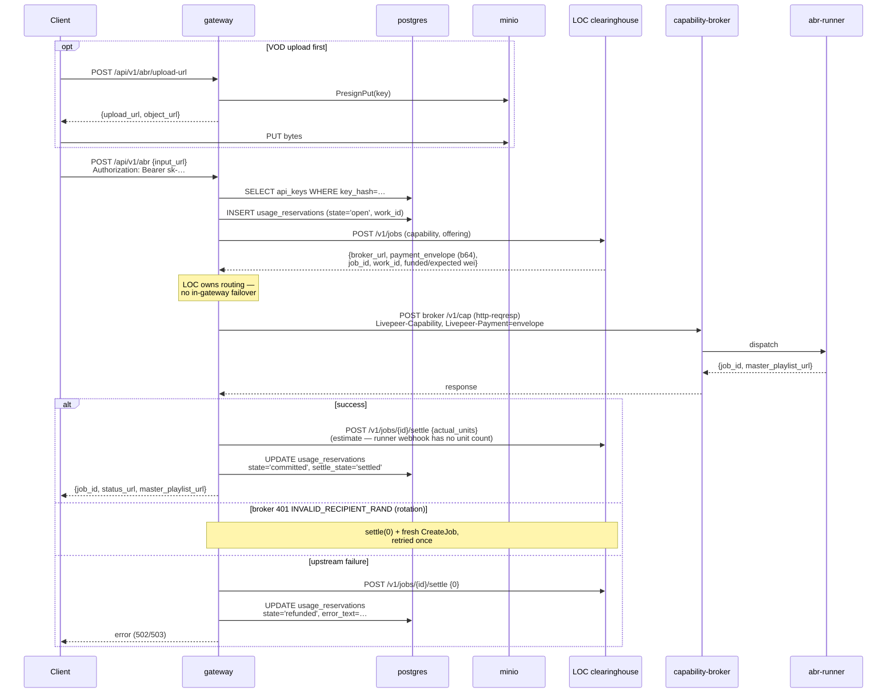
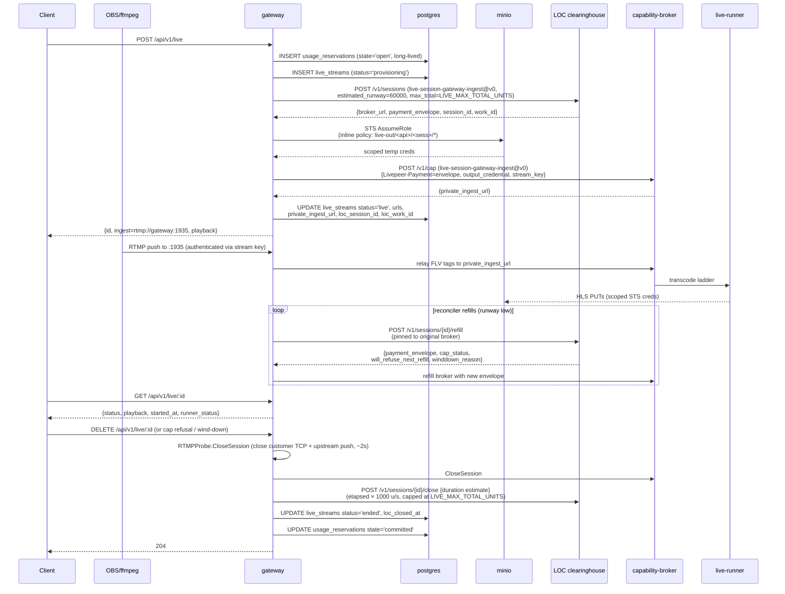
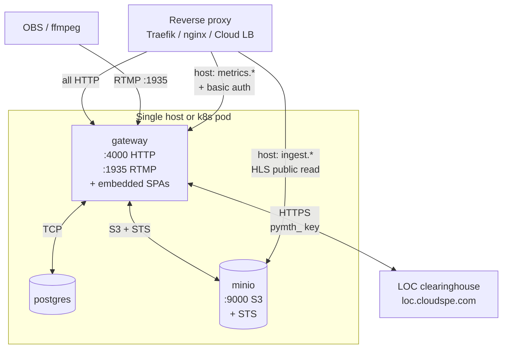

# ARCHITECTURE

Top-level map of the repository. Follows the
[ARCHITECTURE.md convention](https://matklad.github.io/2021/02/06/ARCHITECTURE.md.html):
this file is for *bird's-eye orientation*. Deeper detail lives in
[`docs/design-docs/`](./docs/design-docs/) and in each file's docstring.

For "what does this thing do?" see [`DESIGN.md`](./DESIGN.md).
For invariants, see
[`docs/design-docs/core-beliefs.md`](./docs/design-docs/core-beliefs.md).

---

## 1. System overview


```mermaid
flowchart LR
  user[Developer<br/>HTTP client] -->|/api/v1/*<br/>Bearer sk-…| GW
  visitor[Web visitor] -->|HTTP| GW
  portalUser[Approved user] -->|HTTP + cookie| GW
  admin[Operator] -->|HTTP + X-Admin-Token| GW
  obs[OBS / ffmpeg] -->|RTMP :1935| GW

  GW[gateway<br/>Go / huma + chi<br/>+ embedded SPAs<br/>+ RTMP listener] -->|SQL| DB[(Postgres)]
  GW -->|S3 + STS| MINIO[MinIO<br/>S3-compatible]
  GW -->|HTTPS<br/>pymth_ API key| LOC[LOC — Livepeer<br/>Open Clearinghouse<br/>loc.cloudspe.com]
  GW -->|Livepeer-* headers<br/>+ Livepeer-Payment| BROKER[capability-broker<br/>on orchestrator host]
  GW -->|RTMP relay| BROKER
  BROKER --> RUN_ABR[abr-runner<br/>VOD ladder]
  BROKER --> RUN_LIVE[live-runner<br/>gateway-ingest mode]
  RUN_LIVE -->|HLS PUT<br/>scoped STS creds| MINIO
  GW -->|optional| RESEND[Resend<br/>email]

  LOC -.->|owns routing +<br/>recipient identity| CHAIN[(EVM chain<br/>AI service registry)]

  classDef ours fill:#1f3a2a,stroke:#4cd97b,color:#e8eaed;
  classDef ext fill:#1a1c20,stroke:#9aa0a6,color:#9aa0a6,stroke-dasharray: 4 2;
  class GW,DB,MINIO ours;
  class LOC,BROKER,RUN_ABR,RUN_LIVE,RESEND,CHAIN ours;
```

Production serves the three SPAs (`/`, `/portal/`, `/admin/`) from the
same Go binary that hosts the API — they're embedded via `//go:embed`
under `gateway/internal/server/webroot/`. Dev can still split them onto
their own ports via `make web`.

Green = in this repo or a local compose service. Dashed gray = external
runtime peers (run as their own containers / on other hosts).

---

## 2. Components

| Component | Path | Purpose | Owns |
|---|---|---|---|
| **Gateway** | `gateway/` | Translates transcode requests → Livepeer wire. Hosts the SaaS shell (waitlist, sessions, API keys, admin). Presigns MinIO PUTs for VOD ingest; mints scoped STS creds for live runners. Owns the public RTMP listener on `:1935`. Embeds and serves the three SPAs. | The only stateful Go service in this repo. |
| **Marketing site** | `web/site/` | Public landing + waitlist signup + email-verification page. | Generic copy; rebrand at deploy time. |
| **Portal** | `web/portal/` | Authenticated user dashboard: account, API keys, usage, playground (Live + Transcode tabs). | Cookie-session UX. |
| **Admin** | `web/admin/` | Operator console: waitlist queue, users, usage, capability catalog debug. | `X-Admin-Token` UX (stored in localStorage). |
| **LOC client** | `gateway/internal/proxy/loc/` | HTTPS client for the **Livepeer Open Clearinghouse** (`LOC_BASE_URL`, `LOC_API_KEY`). Mints payment envelopes, owns route selection, settles ledger. Replaces the former `payment-daemon` + `service-registry-daemon`. | Charge-at-create / settle-actual billing against LOC. |

External services pulled at runtime:

| Service | Where | Local profile |
|---|---|---|
| LOC — Livepeer Open Clearinghouse | hosted at `loc.cloudspe.com` (HTTPS) | not in compose |
| `minio` | `minio/minio:latest` | default |
| `minio-bootstrap` (one-shot) | `minio/mc:latest` | default |
| `capability-broker` + runners | (operator side) | not in compose |

---

## 3. Gateway internal layering

```
            ┌────────────────────────────────────────────┐
            │ cmd/gateway/main.go  (process wiring)      │
            ├────────────────────────────────────────────┤
            │ internal/handlers/{waitlist,portal,admin,  │  ← HTTP surface
            │   v1}/  proxy/                             │
            ├────────────────────────────────────────────┤
            │ internal/proxy/service/  proxy/livepeer/   │  ← service / wire
            │ internal/email/  internal/s3/              │
            ├────────────────────────────────────────────┤
            │ internal/repo/  internal/registry/         │  ← data / RPC
            │ internal/schema/                           │
            ├────────────────────────────────────────────┤
            │ internal/config/  internal/db/             │  ← primitives
            │ internal/crypto/  internal/metrics/        │
            ├────────────────────────────────────────────┤
            │ gen/proto/  gen/db/                        │  ← generated
            └────────────────────────────────────────────┘
```

Edges go *down* only. Cross-cutting deps (config, DB pool, S3 client,
email, LOC client, rate limiter) are bundled into a `ServerDeps` struct
in `main.go` and threaded into every handler.

### Source-of-truth split

| Subtree | Origin | Notes |
|---|---|---|
| `internal/proxy/livepeer/` | Ported from `livepeer-modules-openai/gateway/src/proxy/livepeer/` (TS→Go) | Load-bearing wire mechanics — broker headers, `Livepeer-Payment` envelope (minted by LOC), http-reqresp dispatch, rtmp session lifecycle. |
| `internal/proxy/loc/` | Built here | HTTPS client for LOC: `POST /v1/jobs` (envelope + route), `POST /v1/jobs/{id}/settle`, `POST /v1/sessions` (+ `/refill`, `/close`), `GET /v1/capabilities`. LOC owns routing — there is no in-gateway route selector/health anymore. |
| `internal/proxy/{abr,live,capabilities}.go` | Built here | Transcode-specific handlers. |
| Everything else (`internal/handlers/`, `internal/repo/`, `internal/schema/`, `internal/crypto/`, `internal/email/`, `internal/metrics/`, `internal/db/`, `internal/config/`, `cmd/gateway/`) | Built here | Native Go, written for this repository. |

---

## 4. Data storage


```mermaid
erDiagram
  WAITLIST ||--o{ API_KEYS : "owns"
  API_KEYS ||--o{ USER_SESSIONS : "issues"
  API_KEYS ||--o{ USAGE_RESERVATIONS : "logs"
  API_KEYS ||--o{ LIVE_STREAMS : "owns"
  USAGE_RESERVATIONS ||--o| LIVE_STREAMS : "1:1 (live)"

  WAITLIST {
    uuid id PK
    text email UK
    text name
    text ip_hash
    timestamptz email_verified_at
    text verification_token_hash UK "nullable"
    timestamptz verification_token_expires_at
    text status "pending|approved|rejected"
    timestamptz approved_at
    text approved_by
    timestamptz created_at
  }

  API_KEYS {
    uuid id PK
    uuid waitlist_id FK
    text label
    text key_prefix "sk-XXXXNNNN"
    text key_hash "SHA-256+pepper"
    timestamptz created_at
    timestamptz last_used_at
    timestamptz revoked_at
  }

  USER_SESSIONS {
    uuid id PK
    uuid api_key_id FK
    text session_hash
    timestamptz expires_at
    timestamptz revoked_at
    timestamptz created_at
  }

  USAGE_RESERVATIONS {
    uuid id PK
    uuid api_key_id FK
    uuid work_id UK
    text capability
    text offering
    text broker_url
    text state "open|committed|refunded"
    bigint estimated_work_units
    bigint committed_work_units
    numeric price_per_work_unit_wei
    uuid loc_job_id "LOC job id"
    text loc_work_id "LOC work id (hex)"
    numeric funded_value_wei
    numeric expected_value_wei
    numeric billed_value_wei
    text settle_state "none|pending|settled|refunded|failed"
    timestamptz settled_at
    integer latency_ms
    integer status_code
    text error_text
    timestamptz created_at
    timestamptz resolved_at
  }

  LIVE_STREAMS {
    uuid id PK
    uuid api_key_id FK
    uuid reservation_id FK
    text status "provisioning|live|ended|failed"
    text capability
    text offering
    text broker_url
    text ingest_url
    text stream_key_hash
    text playback_url
    uuid loc_session_id "LOC session id"
    text loc_work_id "LOC work id"
    integer loc_refill_count
    timestamptz loc_closed_at
    timestamptz created_at
    timestamptz last_heartbeat_at
    timestamptz ended_at
  }

  CAPABILITIES {
    text capability_id PK
    text offering_id
    text interaction_mode
    text name
    text description
    text provider
    text category
    text eth_address "NULL — LOC owns identity"
    numeric price_per_work_unit_wei
    text broker_url "NULL — LOC owns routing"
    jsonb extra_json
    jsonb constraints_json "NULL — not sourced from LOC"
    boolean active
    timestamptz snapshot_at
  }
```

**One Postgres database. One migration track.** `gateway/migrations/`
holds numbered `.sql` files applied by `golang-migrate` at boot.

### Why a `live_streams` table

VOD ABR maps cleanly to a per-request `usage_reservations` row. Live
RTMP sessions are long-lived (minutes-to-hours), need their own
client-facing ID, ingest URL, stream key, playback URL, and lifecycle
status. Splitting that into `live_streams` keeps `usage_reservations`
as the per-attempt billing log and gives live streams their own
identity surface.

### Why a `capabilities` cache table

`/v1/capabilities` must be cheap. Calling LOC on every request would
couple catalog reads to clearinghouse availability. The background
refresh task (every `REGISTRY_REFRESH_INTERVAL_MS`, default 60s) pulls
LOC's `GET /v1/capabilities` and writes the latest snapshot into
`capabilities`; HTTP reads from there. LOC's catalog carries only
price + work-unit metadata, so `broker_url`, `eth_address`, and
`constraints_json` stay NULL.

---

## 5. Process flows

### 5.1 Signup → verify → approve → key

Identical to `livepeer-modules-openai`. See its
[ARCHITECTURE.md §5.1](../livepeer-modules-openai/ARCHITECTURE.md#51-signup--verify--approve--key)
for the sequence diagram — this repo's flow is byte-for-byte the same.

### 5.2 `/api/v1/abr` request lifecycle


```mermaid
sequenceDiagram
  participant C as Client
  participant GW as gateway
  participant DB as postgres
  participant MIN as minio
  participant LOC as LOC clearinghouse
  participant BRK as capability-broker
  participant RUN as abr-runner

  opt VOD upload first
    C->>GW: POST /api/v1/abr/upload-url
    GW->>MIN: PresignPut(key)
    GW-->>C: {upload_url, object_url}
    C->>MIN: PUT bytes
  end

  C->>GW: POST /api/v1/abr {input_url}<br/>Authorization: Bearer sk-…
  GW->>DB: SELECT api_keys WHERE key_hash=…
  GW->>DB: INSERT usage_reservations (state='open', work_id)
  GW->>LOC: POST /v1/jobs (capability, offering)
  LOC-->>GW: {broker_url, payment_envelope (b64),<br/>job_id, work_id, funded/expected wei}
  Note over GW: LOC owns routing —<br/>no in-gateway failover
  GW->>BRK: POST broker /v1/cap (http-reqresp)<br/>Livepeer-Capability, Livepeer-Payment=envelope
  BRK->>RUN: dispatch
  RUN-->>BRK: {job_id, master_playlist_url}
  BRK-->>GW: response

  alt success
    GW->>LOC: POST /v1/jobs/{id}/settle {actual_units}<br/>(estimate — runner webhook has no unit count)
    GW->>DB: UPDATE usage_reservations<br/>state='committed', settle_state='settled'
    GW-->>C: {job_id, status_url, master_playlist_url}
  else broker 401 INVALID_RECIPIENT_RAND (rotation)
    Note over GW,LOC: settle(0) + fresh CreateJob,<br/>retried once
  else upstream failure
    GW->>LOC: POST /v1/jobs/{id}/settle {0}
    GW->>DB: UPDATE usage_reservations<br/>state='refunded', error_text=…
    GW-->>C: error (502/503)
  end
```

A **settle janitor** (`internal/server/settle_janitor.go`, every
`SETTLE_JANITOR_INTERVAL_SECS`, default 60s) re-drives reservations
left in `settle_state='pending'` after a crash, so encumbered credit is
released on LOC even if the in-line settle didn't complete. If LOC is
unreachable the request fails closed — `503 loc_unavailable` — rather
than dispatching unpaid work.

### 5.3 `/api/v1/live` session lifecycle

The live mode is `live-session-gateway-ingest@v0`: the gateway owns the
public RTMP endpoint and relays customer RTMP to the orchestrator's
private ingest URL. The runner writes HLS directly to gateway-owned
MinIO using short-lived STS credentials scoped to the session's prefix.


```mermaid
sequenceDiagram
  participant C as Client
  participant OBS as OBS/ffmpeg
  participant GW as gateway
  participant DB as postgres
  participant MIN as minio
  participant LOC as LOC clearinghouse
  participant BRK as capability-broker
  participant RUN as live-runner

  C->>GW: POST /api/v1/live
  GW->>DB: INSERT usage_reservations (state='open', long-lived)
  GW->>DB: INSERT live_streams (status='provisioning')
  GW->>LOC: POST /v1/sessions (live-session-gateway-ingest@v0,<br/>estimated_runway=60000, max_total=LIVE_MAX_TOTAL_UNITS)
  LOC-->>GW: {broker_url, payment_envelope, session_id, work_id}
  GW->>MIN: STS AssumeRole<br/>(inline policy: live-out/<api>/<sess>/*)
  MIN-->>GW: scoped temp creds
  GW->>BRK: POST /v1/cap (live-session-gateway-ingest@v0)<br/>{Livepeer-Payment=envelope, output_credential, stream_key}
  BRK-->>GW: {private_ingest_url}
  GW->>DB: UPDATE live_streams status='live', urls,<br/>private_ingest_url, loc_session_id, loc_work_id
  GW-->>C: {id, ingest=rtmp://gateway:1935, playback}

  OBS->>GW: RTMP push to :1935 (authenticated via stream key)
  GW->>BRK: relay FLV tags to private_ingest_url
  BRK->>RUN: transcode ladder
  RUN-->>MIN: HLS PUTs (scoped STS creds)
  loop reconciler refills (runway low)
    GW->>LOC: POST /v1/sessions/{id}/refill<br/>(pinned to original broker)
    LOC-->>GW: {payment_envelope, cap_status,<br/>will_refuse_next_refill, winddown_reason}
    GW->>BRK: refill broker with new envelope
  end

  C->>GW: GET /api/v1/live/:id
  GW-->>C: {status, playback, started_at, runner_status}

  C->>GW: DELETE /api/v1/live/:id (or cap refusal / wind-down)
  GW->>GW: RTMPProbe.CloseSession (close customer TCP + upstream push, ~2s)
  GW->>BRK: CloseSession
  GW->>LOC: POST /v1/sessions/{id}/close {duration estimate}<br/>(elapsed × 1000 u/s, capped at LIVE_MAX_TOTAL_UNITS)
  GW->>DB: UPDATE live_streams status='ended', loc_closed_at
  GW->>DB: UPDATE usage_reservations state='committed'
  GW-->>C: 204
```

Refills no longer open a new `usage_reservations` row per envelope —
there's **one reservation per session**. Refills are pinned server-side
to the session's original broker (no re-resolve). The broker reports
only remaining runway, never consumed units, so session close settles a
**duration estimate**; LOC's ledger reconciliation is authoritative.

### 5.4 Capability-catalog refresh

Background loop every `REGISTRY_REFRESH_INTERVAL_MS` (default 60s) pulls
LOC's `GET /v1/capabilities` and writes the transcode catalog snapshot
into the `capabilities` table (price + work-unit metadata only). HTTP
`/v1/capabilities` reads from the table, never from LOC on the request
path.

### 5.5 Portal cookie auth

Identical to openai gateway.

---

## 6. External dependencies

| What | How it talks to us |
|---|---|
| HTTP clients | HTTPS → `/api/v1/*` (Bearer auth) |
| Portal / admin / site users | HTTPS → embedded SPAs + JSON APIs under `/api/*` |
| OBS / ffmpeg | RTMP → `:1935` (live ingest, authenticated by stream key) |
| LOC — Livepeer Open Clearinghouse | HTTPS (`LOC_BASE_URL`, `LOC_API_KEY` = operator `pymth_` key). Mints payment envelopes, selects routes, settles ledger, serves capability catalog. |
| `capability-broker` (on orch host) | HTTPS, per Livepeer wire spec, with the LOC-minted `Livepeer-Payment` envelope; RTMP relay over a private orch endpoint |
| MinIO | S3 API over HTTP (compose network) + STS `AssumeRole` for per-session live creds |
| Postgres | TCP, single DB for all SaaS + live-stream data |
| Resend | HTTPS, email delivery (optional in dev) |
| EVM chain (AI service registry) | Indirectly — only via LOC, which owns routing + recipient identity |

---

## 7. Boundaries that matter

- **The proxy doesn't know about humans.** `/api/v1/*` authenticates via
  API key and joins to `usage_reservations.api_key_id`. Names + emails
  live in `waitlist`. The only join between the two namespaces is
  `api_keys.waitlist_id`.
- **The wire spec is product-agnostic.** `proxy/livepeer/` only knows
  `Livepeer-Capability` headers + interaction modes. Mapping
  transcode-product → capability happens in
  `proxy/{abr,live,capabilities}.go`.
- **The SaaS shell is product-agnostic.** The same shell powers
  `livepeer-modules-openai`. Transcode specifics live in
  `internal/proxy/{abr,live,capabilities}.go` and the `live_streams`
  table.
- **Media bytes never traverse Go beyond the RTMP relay.** VOD bytes go
  client → MinIO → runner. Live bytes go client → gateway RTMP listener
  → orchestrator's private RTMP endpoint → runner → MinIO (HLS). The
  gateway only signs URLs, mints scoped STS creds, reads catalog state,
  and shuttles RTMP TCP frames — it never demuxes / decodes / encodes.
- **Runners don't import from the gateway and vice versa.** The only
  contract is the Livepeer wire spec, mediated by the broker.

---

## 8. Observability

- **Prometheus** `/metrics` on the gateway (unprefixed, at root),
  optionally Bearer-gated via `METRICS_TOKEN`. Surfaces:
  - Default Go runtime metrics under prefix `video_gateway_*`
  - HTTP: `video_gateway_http_requests_total{method,route,status}`,
    `video_gateway_http_request_duration_seconds`
  - Proxy: `video_gateway_proxy_reservations_total{capability,outcome}`,
    `video_gateway_live_streams_active`
  - Waitlist: `video_gateway_waitlist_signups_total`
  - RTMP ingest: `livepeer_gateway_rtmp_active_publishes`,
    `livepeer_gateway_rtmp_publishes_total{outcome}`
- **Background loops:** capability-catalog refresh
  (`REGISTRY_REFRESH_INTERVAL_MS`), the live reconciler (refills +
  graceful wind-down), and the settle janitor
  (`SETTLE_JANITOR_INTERVAL_SECS`) that backstops stuck LOC settlements.
- **Structured JSON logs** to stdout via `log/slog`. Request IDs
  propagated as `Livepeer-Request-Id` on `/api/v1/*`.
- **`usage_reservations`** + **`live_streams`** are the durable
  per-request and per-session logs (queryable via `/api/admin/usage` and
  `/api/portal/usage`). `live_streams.runner_status_json` holds the
  reconciler's most recent runner-status snapshot for the admin UI.

---

## 9. Deployment shape


```mermaid
flowchart TB
  subgraph host[Single host or k8s pod]
    GW[gateway<br/>:4000 HTTP<br/>:1935 RTMP<br/>+ embedded SPAs]
    DB[(postgres)]
    MIN[(minio<br/>:9000 S3<br/>+ STS)]
  end

  GW <-->|TCP| DB
  GW <-->|S3 + STS| MIN
  GW <-->|HTTPS<br/>pymth_ key| LOC[LOC clearinghouse<br/>loc.cloudspe.com]

  proxy[Reverse proxy<br/>Traefik / nginx / Cloud LB] -->|all HTTP| GW
  proxy -->|host: ingest.*<br/>HLS public read| MIN
  rtmp[OBS / ffmpeg] -->|RTMP :1935| GW
  proxy -->|host: metrics.*<br/>+ basic auth| GW
```

The deployment no longer ships local UDS daemons or a keystore — the
gateway reaches LOC over plain HTTPS. The reverse proxy can put a
single domain in front of the gateway — the SPAs, the API, `/health`,
and `/metrics` all live on the same port. Optionally split metrics
behind basic auth on a separate hostname.

In dev, `make dev` runs gateway + db + minio + bootstrap; the embedded
SPAs are served from `:4000`. Devs who want hot-reload run `make web`
which starts each SPA on its own port and proxies `/api/*` to `:4000`.

---

## 10. Out of scope here

- The Livepeer wire spec itself — owned by `livepeer-network-protocol`
  in the source monorepo.
- The on-chain service registry contracts — operated separately.
- The `capability-broker` + `abr-runner` + live-runner binaries —
  owned by `livepeer-network-modules`.
- Gateway-side playback proxy — v2 concern; v1 returns HLS URLs that
  point at our MinIO (or a CDN fronting it).
- Multi-region deployment topology.
