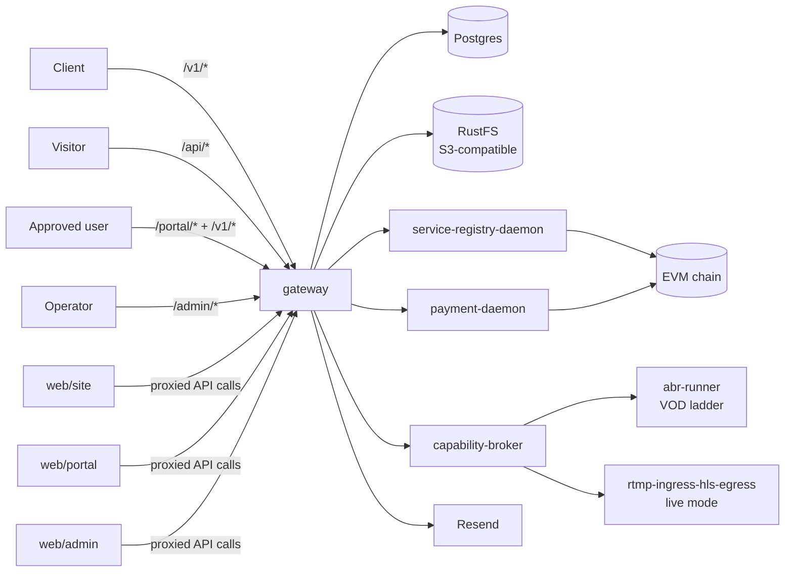

# Livepeer Video Gateway

A transcode-focused gateway and SaaS shell built on top of the
[Livepeer](https://livepeer.org/) network and the
[livepeer-network-modules](https://github.com/Cloud-SPE/livepeer-network-modules)
framework.

This repository is both:
- a working application
- a reference implementation / demo of how to build video workloads
  (VOD ABR transcoding + live RTMP→HLS streaming) against the Livepeer
  network using the resolver, payer, and broker contract surfaces from
  `livepeer-network-modules`

The companion to this gateway is
[`livepeer-modules-openai`](../livepeer-modules-openai), which exposes
the same SaaS shell pattern against an OpenAI-compatible inference
surface. The two gateways share design DNA — read the openai gateway's
docs for context, then read these.

Agents should start at [AGENTS.md](./AGENTS.md). Humans can use this
README as the main overview.

## What this repo is

- `gateway/`: one Go binary that hosts:
  - the transcode `/v1/*` API (`/v1/abr`, `/v1/live`, `/v1/capabilities`)
  - the VOD ingest pre-signed-URL endpoint backed by RustFS
  - a waitlist / verify / approve / API-key shell
  - portal and admin backend routes
  - resolver and payer daemon clients (gRPC over UDS)
- `web/site/`: zero-build Lit marketing and waitlist site
- `web/portal/`: zero-build Lit user portal with account, keys, health,
  playground (Live + Transcode tabs), and usage
- `web/admin/`: zero-build Lit admin with waitlist, users, usage, health,
  and capability-registry diagnostics
- `proto/`: vendored gRPC contracts shared with the Livepeer daemons

This repo does not embed the Livepeer daemon implementations or the
capability-broker / runners. It uses the daemon stack exposed by
`livepeer-network-modules`, especially:
- `service-registry-daemon`
- `payment-daemon`
- `capability-broker` (with `rtmp-ingress-hls-egress` + `http-reqresp` modes)
- `video-runners/abr-runner`

## Why it exists

This project demonstrates a practical video-streaming application
architecture for the Livepeer network:
- discover transcode capabilities from the on-chain registry
- select payment-ready routes from the resolver daemon
- mint per-request payment envelopes via the payer daemon
- forward VOD ABR jobs and allocate RTMP live sessions through
  capability brokers
- preserve enough quote / route metadata for auditing and debugging

It is intentionally opinionated:
- on-chain only
- no static overlay routing
- no unsigned-manifest mode
- no local hardcoded capability catalog
- no local fallback broker path
- no in-process media processing (broker + runners handle bytes)

## Supported API surface

v1 surface:

- `POST /v1/abr` — VOD ABR ladder transcode (input URL → master playlist URL)
- `POST /v1/abr/upload-url` — pre-signed RustFS PUT URL for VOD ingest
- `POST /v1/live` — allocate an RTMP ingest + HLS egress session
- `GET /v1/live/:id` — live stream status + playback URL (poll-only)
- `DELETE /v1/live/:id` — close a live stream
- `GET /v1/capabilities` — registry-backed transcode capability catalog
- `GET /openapi.json` + `GET /docs` — huma-generated OpenAPI 3.1 spec

Not in v1: VOD single-rendition transcode, gateway-side playback proxy,
WebSocket / WebRTC modes, SSE/webhook live status.

## High-level architecture



## Data flow — VOD ABR

```mermaid
flowchart TD
  A[Client] -->|POST /v1/abr/upload-url| GW
  GW -->|presign PUT| RUSTFS
  GW -->|{upload_url, object_url}| A
  A -->|PUT bytes| RUSTFS
  A -->|POST /v1/abr {input_url}| GW
  GW --> RES[open reservation]
  RES --> SEL[resolve route]
  SEL --> PAY[mint Livepeer-Payment]
  PAY --> BRK[POST broker http-reqresp]
  BRK --> RUN[abr-runner]
  RUN -->|master.m3u8 URL| BRK
  BRK -->|response| GW
  GW -->|{job_id, status_url, master_playlist_url}| A
```

## Data flow — Live RTMP→HLS

```mermaid
flowchart TD
  A[Client] -->|POST /v1/live| GW
  GW --> RES[open long-lived reservation]
  RES --> SEL[resolve live route]
  SEL --> PAY[mint Livepeer-Payment]
  PAY --> BRK[broker session-open]
  BRK -->|rtmp://broker/live/:key + hls_url| GW
  GW -->|{id, ingest, playback}| A
  A -->|RTMP push| BRK
  BRK --> RTMPRUN[runner re-encodes ladder]
  RTMPRUN -->|LL-HLS| BRK
  A -->|GET /v1/live/:id| GW
  A -->|HLS playback| BRK
  A -->|DELETE /v1/live/:id| GW
  GW --> BRK
  GW --> COMM[commit/refund reservation]
```

## Repo structure

| Path | Purpose |
|---|---|
| [gateway/](./gateway/) | Go backend, routing, auth, usage tracking, daemon clients, RustFS S3 client |
| [web/site/](./web/site/) | Marketing site and waitlist signup |
| [web/portal/](./web/portal/) | User portal and playground (Live + Transcode) |
| [web/admin/](./web/admin/) | Operator/admin UI |
| [proto/](./proto/) | Vendored gRPC contracts |
| [docs/](./docs/) | Design docs, product specs, exec plans |

## Configuration

The runtime is env-driven. See [.env.example](./.env.example) for the
full manifest. Key groups:

- **Postgres** — `POSTGRES_*`, `DATABASE_URL`
- **Gateway HTTP** — `BASE_URL`, `PUBLIC_SITE_URL`, `PUBLIC_PORTAL_URL`,
  `ALLOWED_ORIGINS`, `LOG_LEVEL`, `GATEWAY_HOST_PORT`
- **SaaS shell secrets** — `ADMIN_TOKEN`, `API_KEY_HASH_PEPPER`,
  `IP_HASH_PEPPER`, `METRICS_TOKEN`, `SESSION_TTL_HOURS`
- **RustFS / S3** — `RUSTFS_*`, `S3_*`
- **Email** — `RESEND_API_KEY`, `FROM_EMAIL`
- **Livepeer daemons + chain** — `CHAIN_RPC`, `CHAIN_ID`,
  `AI_SERVICE_REGISTRY_ADDRESS`, `CONTROLLER_ADDRESS`,
  `LIVEPEER_KEYSTORE_DIR`
- **Rate limiting** — `V1_RATE_LIMIT_PER_MINUTE`, `V1_RATE_LIMIT_BURST`
- **Capability identifiers** — `ABR_CAPABILITY`, `LIVE_CAPABILITY`

## Quick start

```bash
git clone <repo-url> livepeer-modules-transcode-gateway
cd livepeer-modules-transcode-gateway
cp .env.example .env

# Fill at least ADMIN_TOKEN, API_KEY_HASH_PEPPER, IP_HASH_PEPPER.
# For real /v1/* traffic also fill CHAIN_RPC, AI_SERVICE_REGISTRY_ADDRESS,
# LIVEPEER_KEYSTORE_DIR.

# Bring up db + rustfs + bootstrap + gateway
make dev

# Add livepeer daemons
make dev-livepeer

# Health check
curl http://localhost:4000/health

# Start the SPAs (separate terminal)
make web
```

Default local ports:
- site: `http://localhost:3000`
- portal: `http://localhost:3001`
- admin: `http://localhost:3002`
- gateway: `http://localhost:4000`
- rustfs: `http://localhost:9000` (S3 API), `http://localhost:9001` (console)

## Build

```bash
make build       # go build + pnpm -r build
make go-build    # gateway binary only
make go-test     # gateway tests
docker compose build gateway
```

## Deployment

See [DEPLOYMENT.md](./DEPLOYMENT.md).

## Related documents

- [AGENTS.md](./AGENTS.md)
- [DESIGN.md](./DESIGN.md)
- [ARCHITECTURE.md](./ARCHITECTURE.md)
- [DEPLOYMENT.md](./DEPLOYMENT.md)
- [PLANS.md](./PLANS.md)
- [docs/design-docs/index.md](./docs/design-docs/index.md)
- [docs/product-specs/index.md](./docs/product-specs/index.md)
- [docs/references/openai-harness-engineer.md](./docs/references/openai-harness-engineer.md)
