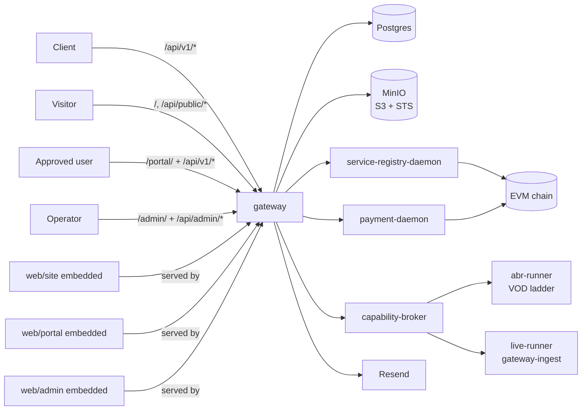

# Livepeer Video Gateway

A transcode-focused gateway and SaaS shell built on top of the
[Livepeer](https://livepeer.org/) network and the
[livepeer-network-modules](https://github.com/Cloud-SPE/livepeer-network-modules)
framework.

This repository is both:
- a working application
- a reference implementation / demo of how to build video workloads
  (VOD ABR transcoding + live RTMP→HLS streaming) against the Livepeer
  network using the resolver, payer, and broker contract surfaces from
  `livepeer-network-modules`

The companion to this gateway is
[`livepeer-modules-openai`](../livepeer-modules-openai), which exposes
the same SaaS shell pattern against an OpenAI-compatible inference
surface. The two gateways share design DNA — read the openai gateway's
docs for context, then read these.

Agents should start at [AGENTS.md](./AGENTS.md). Humans can use this
README as the main overview.

## What this repo is

- `gateway/`: one Go binary that hosts:
  - the transcode `/api/v1/*` API (`/api/v1/abr`, `/api/v1/live`, `/api/v1/capabilities`)
  - the VOD ingest pre-signed-URL endpoint backed by MinIO
  - a waitlist / verify / approve / API-key shell
  - portal and admin backend routes (under `/api/portal/*`, `/api/admin/*`)
  - resolver and payer daemon clients (gRPC over UDS)
  - **the three SPAs**, served from a `//go:embed` webroot at `/`, `/portal/`, and `/admin/`
  - the public RTMP listener at `:1935` for live ingest
- `web/site/`: zero-build Lit marketing and waitlist site
- `web/portal/`: zero-build Lit user portal with account, keys, health,
  playground (Live + Transcode tabs), and usage
- `web/admin/`: zero-build Lit admin with waitlist, users, usage, health,
  capability-registry diagnostics, and live-streams view (with runner status)
- `proto/`: vendored gRPC contracts shared with the Livepeer daemons

In production, **one process serves everything from one port** (default
`4000`): the API, the SPAs (embedded via `//go:embed`), `/health`, and
`/metrics`. The dev-only `make web` workflow still runs each SPA on its
own port (3000/3001/3002) with hot-reload-style file serving and proxies
`/api/*` back to the gateway at `:4000`. Both modes coexist.

This repo does not embed the Livepeer daemon implementations or the
capability-broker / runners. It uses the daemon stack exposed by
`livepeer-network-modules`, especially:
- `service-registry-daemon`
- `payment-daemon`
- `capability-broker` (with `live-session-gateway-ingest` + `http-reqresp` modes)
- `video-runners/abr-runner` + the live runner

## Why it exists

This project demonstrates a practical video-streaming application
architecture for the Livepeer network:
- discover transcode capabilities from the on-chain registry
- select payment-ready routes from the resolver daemon
- mint per-request payment envelopes via the payer daemon
- forward VOD ABR jobs through capability brokers
- own the public RTMP endpoint for live; relay to the orchestrator's
  private RTMP endpoint while the runner writes HLS to gateway-owned MinIO
- preserve enough quote / route metadata for auditing and debugging

It is intentionally opinionated:
- on-chain only
- no static overlay routing
- no unsigned-manifest mode
- no local hardcoded capability catalog
- no local fallback broker path
- no in-process media processing (broker + runners handle bytes)

## Supported API surface

All API routes live under `/api/*`. `/health` and `/metrics` stay at
root for load-balancer and Prometheus conventions.

v1 surface:

- `POST /api/v1/abr` — VOD ABR ladder transcode (input URL → master playlist URL)
- `POST /api/v1/abr/upload-url` — pre-signed MinIO PUT URL for VOD ingest
- `POST /api/v1/live` — allocate an RTMP ingest + HLS egress session
- `GET /api/v1/live/:id` — live stream status + playback URL (poll-only)
- `DELETE /api/v1/live/:id` — close a live stream (synchronous RTMP teardown)
- `GET /api/v1/capabilities` — registry-backed transcode capability catalog
- `GET /openapi.json` + `GET /docs` — huma-generated OpenAPI 3.1 spec

Public + ops endpoints:

- `POST /api/public/waitlist` / `GET /api/public/verify` — waitlist signup + email verification
- `POST /api/webhooks/abr` — runner status callback for ABR jobs
- `/api/portal/*` — portal cookie-session endpoints
- `/api/admin/*` — admin endpoints (X-Admin-Token)
- `/health`, `/metrics` — at root (unprefixed)

Not in v1: VOD single-rendition transcode, gateway-side playback proxy,
WebSocket / WebRTC modes, SSE/webhook live status.

## High-level architecture



## Data flow — VOD ABR

```mermaid
flowchart TD
  A[Client] -->|POST /api/v1/abr/upload-url| GW
  GW -->|presign PUT| MINIO
  GW -->|{upload_url, object_url}| A
  A -->|PUT bytes| MINIO
  A -->|POST /api/v1/abr {input_url}| GW
  GW --> RES[open reservation]
  RES --> SEL[resolve route]
  SEL --> PAY[mint Livepeer-Payment]
  PAY --> BRK[POST broker http-reqresp]
  BRK --> RUN[abr-runner]
  RUN -->|master.m3u8 URL| BRK
  BRK -->|response| GW
  GW -->|{job_id, status_url, master_playlist_url}| A
```

## Data flow — Live RTMP→HLS (gateway-ingest)

```mermaid
flowchart TD
  A[Client] -->|POST /api/v1/live| GW
  GW --> RES[open long-lived reservation]
  RES --> SEL[resolve live route]
  SEL --> STS[mint scoped MinIO creds<br/>via STS AssumeRole]
  STS --> PAY[mint Livepeer-Payment]
  PAY --> BRK[broker session-open<br/>live-session-gateway-ingest@v0]
  BRK -->|{private_ingest_url}| GW
  GW -->|{id, ingest=rtmp://gateway:1935, playback}| A
  A -->|RTMP push to gateway:1935| GW
  GW -->|relay FLV tags| BRK
  BRK --> LIVERUN[live-runner re-encodes]
  LIVERUN -->|HLS PUT| MINIO
  A -->|GET /api/v1/live/:id| GW
  A -->|HLS playback| MINIO
  A -->|DELETE /api/v1/live/:id| GW
  GW -->|close customer + upstream RTMP| BRK
  GW --> COMM[commit/refund reservation]
```

## Repo structure

| Path | Purpose |
|---|---|
| [gateway/](./gateway/) | Go backend, routing, auth, usage tracking, daemon clients, MinIO S3 client + STS, RTMP listener, embedded SPAs |
| [web/site/](./web/site/) | Marketing site and waitlist signup |
| [web/portal/](./web/portal/) | User portal and playground (Live + Transcode) |
| [web/admin/](./web/admin/) | Operator/admin UI |
| [proto/](./proto/) | Vendored gRPC contracts |
| [docs/](./docs/) | Design docs, product specs, exec plans |

Build flow: `make embed-webroot` copies `web/{site,portal,admin}` into
`gateway/internal/server/webroot/` (gitignored). `go build` then
`//go:embed`s the result into the binary. The Dockerfile does the
equivalent.

## Configuration

The runtime is env-driven. See [.env.example](./.env.example) for the
full manifest. Key groups:

- **Postgres** — `POSTGRES_*`, `DATABASE_URL`
- **Gateway HTTP** — `BASE_URL`, `PUBLIC_SITE_URL`, `PUBLIC_PORTAL_URL`,
  `ALLOWED_ORIGINS`, `LOG_LEVEL`, `GATEWAY_HOST_PORT`
- **SaaS shell secrets** — `ADMIN_TOKEN`, `API_KEY_HASH_PEPPER`,
  `IP_HASH_PEPPER`, `METRICS_TOKEN`, `SESSION_TTL_HOURS`
- **MinIO / S3** — `MINIO_*` (server-side root creds + console),
  `S3_*` (gateway's client-side creds + endpoint + bucket)
- **Email** — `RESEND_API_KEY`, `FROM_EMAIL`
- **Livepeer daemons + chain** — `CHAIN_RPC`, `CHAIN_ID`,
  `AI_SERVICE_REGISTRY_ADDRESS`, `CONTROLLER_ADDRESS`,
  `LIVEPEER_KEYSTORE_DIR`
- **Live RTMP ingest** — `LIVE_RTMP_PORT` (default 1935),
  `LIVE_PLAYBACK_BASE_URL`, `LIVE_S3_CREDENTIAL_TTL_HOURS`
- **Rate limiting** — `V1_RATE_LIMIT_PER_MINUTE`, `V1_RATE_LIMIT_BURST`
- **Capability identifiers** — `ABR_CAPABILITY`, `LIVE_CAPABILITY`,
  `LIVE_GATEWAY_INGEST_OFFERING`

## Quick start

```bash
git clone <repo-url> livepeer-modules-transcode-gateway
cd livepeer-modules-transcode-gateway
cp .env.example .env

# Fill at least ADMIN_TOKEN, API_KEY_HASH_PEPPER, IP_HASH_PEPPER.
# For real /api/v1/* traffic also fill CHAIN_RPC, AI_SERVICE_REGISTRY_ADDRESS,
# LIVEPEER_KEYSTORE_DIR.

# Bring up db + minio + bootstrap + gateway (with embedded SPAs)
make dev

# Add livepeer daemons
make dev-livepeer

# Health check
curl http://localhost:4000/health

# Optional: dev SPAs with their own ports + hot reload
make web
```

Default local ports:
- gateway (binary, serves API + embedded SPAs): `http://localhost:4000`
  - site at `/`, portal at `/portal/`, admin at `/admin/`
- gateway RTMP ingest: `rtmp://localhost:1935/live/<stream_key>`
- dev-mode SPA servers (only when running `make web`):
  - site: `http://localhost:3000` → proxies `/api/*` to `:4000`
  - portal: `http://localhost:3001` → proxies `/api/*` to `:4000`
  - admin: `http://localhost:3002` → proxies `/api/*` to `:4000`
- minio: `http://localhost:9000` (S3 API), `http://localhost:9001` (console)

## Build

```bash
make build           # embed-webroot + go build + pnpm -r build
make embed-webroot   # copy web/{site,portal,admin} into gateway/internal/server/webroot
make go-build        # gateway binary only (assumes embed-webroot already ran)
make go-test         # gateway tests
docker compose build gateway
```

## Docker image publishing

The published image is `tztcloud/livepeer-video-gateway:<TAG>` on Docker
Hub. Two ways to publish a release:

- **Manual.** `docker login docker.io` (once) then
  `make docker-publish TAG=v1.3.0`.
- **CI.** Push a git tag: `git tag v1.3.0 && git push --tags`. The
  workflow at `.github/workflows/ci.yml` builds + pushes via the
  `DOCKERHUB_USERNAME` + `DOCKERHUB_TOKEN` secrets (org or repo scope).

The local compose stack still uses the `livepeer-video-gateway:dev` tag
for `make dev`.

## Deployment

See [DEPLOYMENT.md](./DEPLOYMENT.md).

## Related documents

- [AGENTS.md](./AGENTS.md)
- [DESIGN.md](./DESIGN.md)
- [ARCHITECTURE.md](./ARCHITECTURE.md)
- [DEPLOYMENT.md](./DEPLOYMENT.md)
- [PLANS.md](./PLANS.md)
- [docs/design-docs/index.md](./docs/design-docs/index.md)
- [docs/product-specs/index.md](./docs/product-specs/index.md)
- [docs/references/openai-harness-engineer.md](./docs/references/openai-harness-engineer.md)
